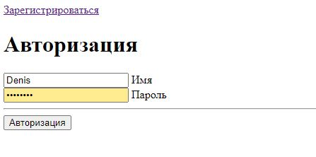
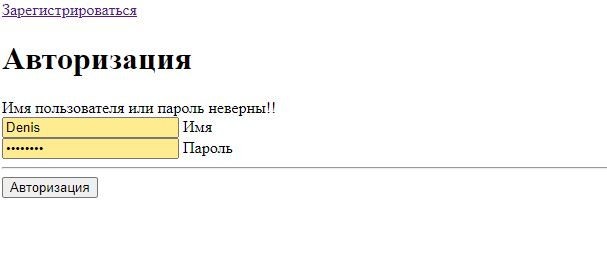
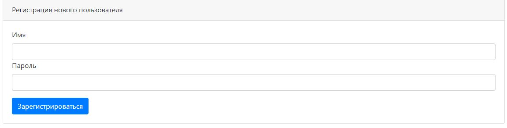
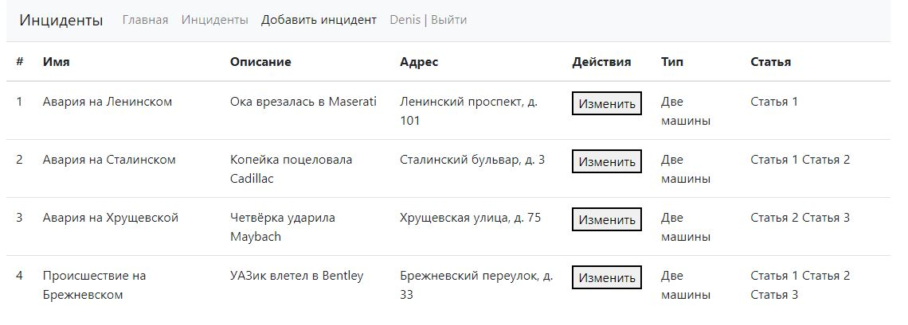
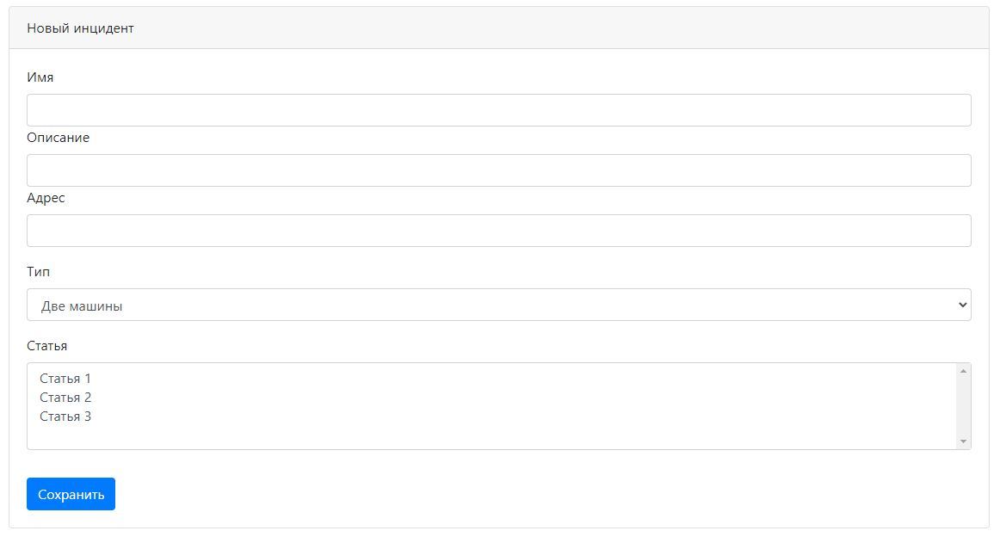
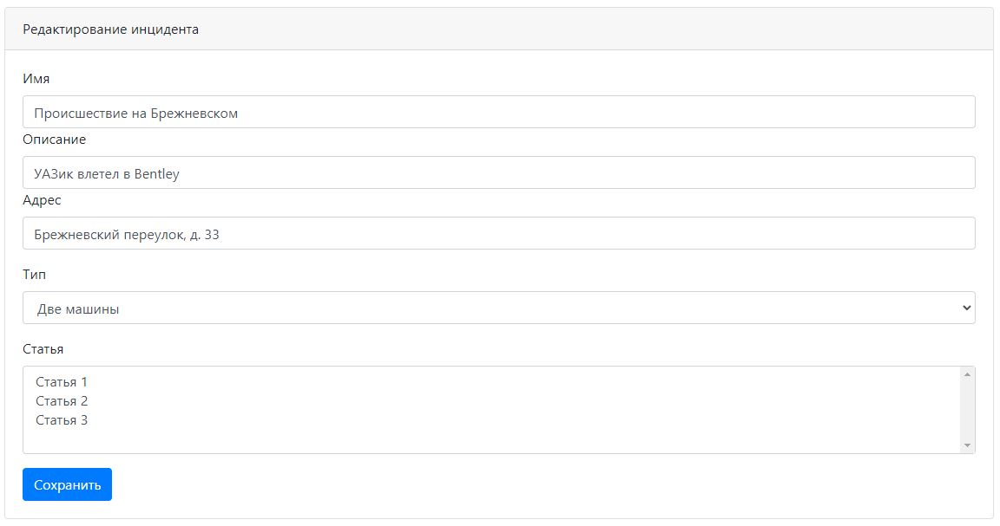

# job4j_accidents

## Описание проекта
Данный проект представляет собой реализацию сайта по регистрации инцидентов.

## Стек технологий
* Java 17
* PostgreSQL 14
* Apache Maven 3.8.5
* Spring Boot 2.7.5
* Liquibase 3.6.2
* Lombok 1.18.24
* JUnit 5.8.2
* Mockito 4.5.1
* Checkstyle 8.29
* Thymeleaf 3.0.15

## Требуемое окружение для запуска проекта
* Браузер
* JDK 17
* Apache Maven 3.8
* PostgreSQL 14

## Инструкция по запуску проекта
1) Скачать и разархивировать проект
2) В PostgreSQL создать базу данных cinema (url = `jdbc:postgresql://127.0.0.1:5432/accidents`)
3) Открыть командную строку и перейти в папку с проектом, например `cd c:\projects\job4j_accidents`
4) Выполнить команду `mvn install`
5) Перейти в папку target командой `cd target`
6) Выполнить команду `java -jar job4j_accidents-1.0.jar`
7) Перейти по ссылке `http://localhost:8081/accidents`

## Взаимодействие с приложением

### При открытии сайта попадаем на страницу для авторизации

### Если учетная запись не найдена, то будет выведено сообщение

### Если учетной записи ещё нет, то необходимо зарегистрироваться

### После успешной аутентификации попадаем на страницу со списком всех инцидентов

### Страница с формой добавления инцидента

### Страница с формой редактирования инцидента

## Контакты для связи
&nbsp;&nbsp;
&nbsp;&nbsp;
